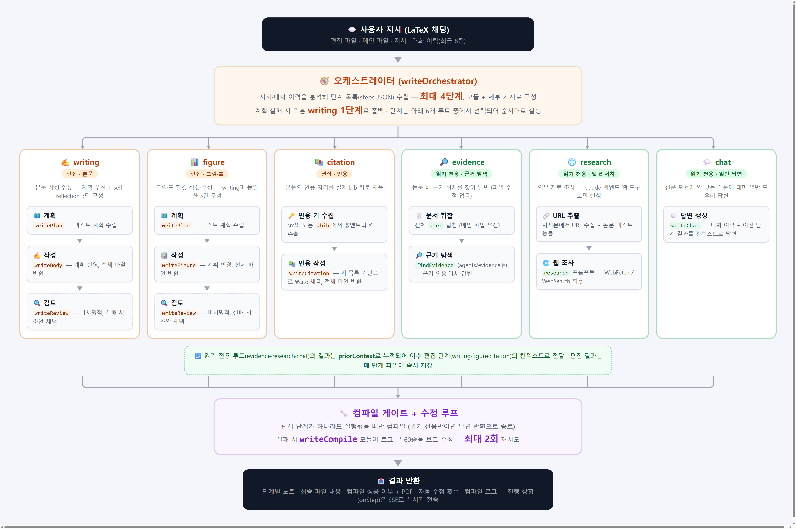

# Korean Paper Agent Console (KPAC) · v0.5.7

영어 논문을 **읽고 분석**하는 것에서 끝나지 않고, LaTeX 논문을 **직접 쓰고 컴파일**하는 데까지 돕는 데스크탑 앱입니다. 두 개의 작업 모드로 구성됩니다.

- **📊 논문 분석 (분석팀)** — 영어 논문 PDF 한 편을 넣으면 LLM 에이전트들이 협업해 **각 주장(claim)에 원문 근거가 매핑된 한국어 분석 리포트**를 만들고, 근거를 클릭하면 **PDF 원문 위치로 점프 + 하이라이트**합니다.
- **✍️ 논문 작성 (작성팀)** — LaTeX 프로젝트 **ZIP을 드롭하면 자동 컴파일**하고, Overleaf처럼 좌(편집)/우(PDF)로 보며, **AI 작성팀(멀티에이전트)** 에게 채팅으로 본문·그림·표·인용 수정을 맡길 수 있습니다. 수정 후 항상 자동 재컴파일됩니다.

본 도구는 **어떤 LLM API 키도 사용하지 않습니다.** 사용자의 **Claude Pro/Max 구독**에 연결된 `claude` Code CLI, 또는 **ChatGPT 구독**에 연결된 `codex` CLI 를 로컬에서 subprocess 로 호출해 동작합니다(역할별로 선택 가능). 토큰당 추가 과금이 없고, PDF·원고는 외부 서버에 업로드되지 않습니다.

## 한 줄 요약

> 영어 논문 PDF → claim 별 근거가 검증된 한국어 리포트 + 클릭형 원문 하이라이트.
> LaTeX ZIP → 자동 컴파일 + 인앱 편집 + STORM식 멀티에이전트 작성팀.

---

## 두 개의 작업 모드

| | 📊 논문 분석 (분석팀) | ✍️ 논문 작성 (작성팀) |
|---|---|---|
| **입력** | 영어 논문 **PDF** | LaTeX 프로젝트 **ZIP** |
| **산출** | 한국어 근거-검증 리포트 + 핵심 분석 표 | 컴파일된 PDF + 편집된 `.tex` |
| **상호작용** | 근거 클릭 점프 · 영역 선택 질문 · 후속 채팅 | Monaco 편집 · 채팅으로 AI 수정 · SyncTeX 점프 |
| **에이전트** | orchestrator → analyst → verifier → writer (+coreInsight, +근거탐색) | writeOrchestrator(다단계 계획) → plan → body/figure → review → citation → compile (+근거탐색, +리서치/웹, +일반채팅) |

드롭 한 번으로 모드가 자동 분기됩니다 — **PDF를 놓으면 분석, ZIP을 놓으면 작성(컴파일)**.

---

## 📊 논문 분석 (분석팀)

영어 논문 PDF 한 편을 입력하면 4개의 LLM 에이전트가 협업해, 각 주장에 원문 근거가 매핑된 한국어 11-섹션 리포트를 생성합니다.

```
[분석 트리거] PDF 첨부 + (선택) 강조사항 입력
─────────────────────────────────────────────────────────────
  utils/parsePdf → text
                              │
                              ▼
[파이프라인] pipeline.js — 4단계 + 보조
─────────────────────────────────────────────────────────────
  ① orchestrator   emphasis 해석 → directive
       │
  ② analyst        claim + reproducibility 추출
       │
  ③ verifier       BM25 retrieval + claim 별 근거 확인
       │           라벨: supported / partially_supported /
       │                 unsupported / contradicted
       ├ (병렬) focusedAudit   ad-hoc 감사 작업
       │
  ④ writer         한국어 11-섹션 Markdown 리포트

  각 단계는 core/llmConfig 에 따라
  → core/claudeClient  (spawn 'claude -p --output-format json')  또는
  → core/codexCli      (spawn 'codex exec --skip-git-repo-check') 로 라우팅
                              │
                              ▼
[결과] 한국어 리포트 + claim 별 검증 표 + 단계별 메트릭
        → 라이브러리에 영구 저장 + 우측 PDF 뷰어에서 근거 하이라이트
```

**주요 기능**

- **다단계 LLM 파이프라인** — orchestrator(emphasis 해석) → analyst(claim 추출) → verifier(BM25 + LLM 근거 확인) → writer(한국어 11-섹션 리포트)
- **Claim 별 원문 근거 매핑** — 모든 주장에 `supported / partially_supported / unsupported / contradicted` 라벨 + 원문 발췌 + 섹션·페이지 인용
- **분할 화면 PDF 뷰어 (PDF.js)** — 좌 채팅 / 우 논문 PDF. 토글·경계 드래그로 폭 조절(분석 중에도 동작), 텍스트 선택 가능
- **PDF 확대/축소** — **Ctrl+휠**(또는 트랙패드 핀치), 헤더의 `−`/`+` 버튼으로 커서 기준 확대·축소. 현재 배율(%)이 드롭다운에 표시되고 50~300% 프리셋으로 바로 변경, `⊡` 버튼으로 **패널 폭 맞춤** 복귀(작성팀 PDF 뷰어 공통)
- **클릭형 근거 인용** — 리포트의 각 `[n]` 링크를 누르면 우측 PDF 에서 해당 인용문 위치로 스크롤 + 하이라이트(텍스트 검색 기반, 좌표 비저장)
- **PDF 영역 선택 질문** — PDF 에서 영역을 드래그 선택하거나 Figure 후보를 클릭해 그 부분을 바로 질문
- **핵심 분석 표** — `핵심 분석` 탭에서 버튼 한 번으로 노벨티·핵심 방법·실험 근거·한계를 한국어 표로 압축. 각 행은 검증된 claim 과 연결
- **근거 탐색 위임** — "이 논문에 ~라는 주장을 하는 파트가 있어?"처럼 묻는 질문은 오케스트레이터가 **근거 탐색 에이전트**에게 위임해, 원문 발췌와 위치로 답합니다(아래 [근거 탐색](#-근거-탐색-에이전트-분석팀-작성팀-공용) 참고)
- **분석 후 후속 채팅** — 논문·리포트 컨텍스트 기반 자유 질문. 답변의 핵심 문장에도 근거 인용이 붙어 클릭 시 원문 하이라이트

---

## ✍️ 논문 작성 (작성팀)

LaTeX 프로젝트 **ZIP을 드롭하면** 자동으로 압축을 풀어 **컴파일**하고, 인앱 에디터(Monaco)로 편집한 뒤 재컴파일합니다. 컴파일 결과 PDF 는 우측 뷰어에 표시됩니다(Overleaf 식 좌/우 50:50).

### LaTeX 프로젝트 편집 (파일 탐색기)

- **ZIP 드롭 → 자동 컴파일** — 채팅 없이 바로 컴파일된 프로젝트가 라이브러리에 생성. 창 크기·전체화면이 바뀌어도 좌(편집)/우(PDF) **비율 유지**
- **디렉터리 트리 + 토글** — `figures/`, `sections/` 등 하위 폴더가 접이식 트리로 표시. **☰ 버튼으로 탐색기 접기/펼치기**
- **인앱 에디터 (Monaco)** — `.tex/.bib/.cls/.sty` 등 텍스트 파일 편집·저장(자동 저장), LaTeX 문법 강조
- **그림 열람 & 업로드** — `png/jpg/gif/webp/bmp/svg`/**`pdf`** 를 트리에서 클릭하면 미리보기(그림 PDF도 표시 — 컴파일 출력 PDF만 숨김). **"⬆ 이미지" 버튼 또는 드래그&드롭**으로 추가(20MB)
- **우클릭 파일 관리** — 파일 트리에서 **우클릭 → 새 파일 / 새 폴더 / 삭제**(메인 파일·경로탈출 차단, 인라인 이름 입력)
- **드래그&드롭 이동** — 파일을 끌어서 **폴더 안/밖(루트)으로 이동**(메인 파일 이동 시 자동 갱신, 대상 중복·경로탈출 차단)
- **전체화면 모드 (⛶)** — 사이드바·상단바를 숨겨 편집기+PDF만 꽉 차게(Esc로 해제). 좌측 사이드바도 **☰/«** 로 접기/펼치기
- **SyncTeX 역방향 점프** — PDF 한 지점 더블클릭 → 대응 `.tex` 줄로 이동 + 하이라이트
- **컴파일 상태 배지 + 로그**, **프로젝트 ZIP 다운로드**(중간 산출물 제외)
- **작성팀 채팅 영구 저장** — 채팅 로그가 프로젝트별로 디스크에 저장돼 **앱을 껐다 켜도 유지**

### AI 작성팀 — 워크스페이스 편집 (Claude·Codex 공용, v0.5.6+)

채팅 지시는 **워크스페이스 편집**으로 처리됩니다: 에이전트(**Claude Code 또는 Codex**)가 **프로젝트 폴더(src)를 작업 폴더로 직접 탐색·수정** 합니다(Claude는 acceptEdits, Codex는 `--sandbox workspace-write`). 기존 "전문을 프롬프트에 넣고 전문을 돌려받는" 방식과 달리,

- **파일 크기 제한 없음** — 필요한 부분만 읽고 바뀌는 부분만 고쳐 토큰도 적게 씀
- **멀티파일 일관 수정** — 명령어 이름 변경, 본문+`.bib` 동시 수정, 섹션 이동 등
- **그림(figure) 인식** — 본문이 참조하는 **그림 파일(`fig1.png` 등)을 직접 열어 그 내용을 보고** 캡션·본문에 반영. Claude는 이미지 파일을 직접 읽고, Codex는 지시가 가리키는 그림을 **`--image` 로 첨부**해 모델이 실제로 보게 함
- **안전장치** — 편집 전 스냅샷을 떠서 변경을 추적하고, 텍스트 소스(`.tex/.bib/...`) 외 파일이 변경되면 **전부 자동 롤백**. 실패 시에도 롤백 후 아래 멀티에이전트 방식으로 **자동 폴백**
- 수정 후 **컴파일 게이트**(실패 시 워크스페이스에서 자동 수정, 최대 2회), 변경 파일 목록이 채팅에 표시되고 파일 트리가 자동 갱신

워크스페이스 편집이 실패하면(텍스트 외 파일 변경 시도·타임아웃 등) 자동으로 아래 멀티에이전트 파이프라인으로 폴백합니다.

### AI 작성팀 (STORM식 멀티에이전트 + 다단계 조율 — Codex/폴백)

채팅으로 수정을 지시하면, **오케스트레이터가 단계 계획(plan)** 을 세웁니다. 단순 작업은 한 단계, **연쇄가 필요하면 다단계**(최대 4) — 예: "이 저널 스코프 URL 보고 introduction 고쳐줘" → `리서치 → 본문`, "related work 찾아서 써줘" → `리서치 → 본문`, **"그림이랑 설명 글 같이"** → `그림·표 → 본문`(각 에이전트가 한 가지에 집중해 출력이 잘리지 않게). 앞 단계 결과가 다음 단계 컨텍스트로 자동 전달됩니다. 본문·그림/표는 **전문을 다 읽고** **계획 → 작성 → 검토** 멀티에이전트로 처리해 전체 흐름에 맞게 고칩니다. 어느 전문 모듈에도 맞지 않는 일반 질문은 **튜닝 없는 일반 채팅**으로 답합니다. 수정 후 **컴파일 게이트**가 항상 실행되어 오류를 자동 수정하고, 마지막엔 **수정 전/후 인라인 diff(초록·빨강)** 로 적용/되돌리기를 고릅니다. 진행 단계는 채팅에 **실시간(SSE)** 표시되며, **대화 맥락**을 참고해 "그 부분 고쳐" 같은 지시도 직전 대화로 해석합니다.

<p align="center">
  
</p>

> 오케스트레이터(`writeOrchestrator`)가 지시를 분석해 **최대 4단계** 계획을 세우고, 위 6개 모듈 루트 중에서 단계를 골라 순서대로 실행합니다. 편집 루트(**writing·figure** = 계획→작성→검토, **citation** = bib 키 수집→작성)는 파일을 고치고, 읽기 전용 루트(**evidence·research·chat**)의 결과는 `priorContext`로 누적돼 이후 편집 단계의 컨텍스트로 전달됩니다. 편집이 하나라도 있었으면 **컴파일 게이트**가 실행돼 실패 시 `writeCompile`이 자동 수정(최대 2회)하고, 마지막에 **수정 전/후 인라인 diff**(적용/되돌리기) + 재컴파일된 PDF가 표시됩니다. 진행 단계는 **SSE로 실시간** 스트림됩니다.

- **표(table) 1급 지원** — 그림·표 모듈이 tikz/그림뿐 아니라 `booktabs`·`tabularx`·`multirow`/`multicolumn` 표를 동등하게 생성·수정. TikZ 다이어그램은 `positioning` 상대 배치로 노드 겹침·화살표 꼬임을 방지
- **논문 작성 스타일 규칙 9종** (작성·검토 양쪽에서 강제):
  1. 방어적 표현 — `can → could`, `may → might`
  2. 실험으로 뒷받침되는 범위 안에서만 주장(과장 금지)
  3. **새로 생성·수정한 문단에만** 한국어 `%` 주석(기존 문단은 건드리지 않음)
  4. 약어는 첫 등장 시 "용어(약어)" 정의 후 약어만, abstract 엔 약어·대문자 남발 금지
  5. 인용 필요 자리엔 **오직 빈 `\cite{}`**(placeholder 텍스트 금지) — 특히 서론/related work는 거의 문장마다
  6. 볼드·이탤릭 없이 줄글로 서술
  7. 약어 풀어쓰기는 고유명사가 아니면 소문자 (`Adaptive Forecast Routing` → `adaptive forecast routing`)
  8. 산문에서 `:`·`;` 로 잇지 않고 `, that is,` 또는 문장 분리
  9. method·실험/결과 등 긴 섹션은 `\subsection` 으로 구획(짧은 섹션은 그대로)

### 🔎 근거 탐색 에이전트 (분석팀 ⇄ 작성팀 공용)

"이 문서에 ~라는 주장/내용이 있어? 어디에 있어?" 같은 질문에, **문서를 수정하지 않고** 원문 발췌와 위치(섹션/단락)로 답하는 싱글 에이전트입니다.

- **분석팀** — 분석한 논문 원문을 대상으로, 채팅에서 근거 탐색 질문을 하면 오케스트레이터가 자동으로 위임
- **작성팀** — 편집 중인 프로젝트의 `.tex` 전체를 대상으로, "내 논문에 이미 ~를 다룬 부분이 있나?" 류 질문에 읽기 전용으로 답(파일·컴파일 불변)

### 🌐 리서치(웹) 에이전트 (작성팀, 읽기 전용)

URL을 주거나 외부 자료가 필요한 요청에서, **`WebFetch`/`WebSearch`** 로 웹을 읽어 방향을 제안합니다(파일 수정 X, **Claude 백엔드 전용**).

- **준 URL 읽기** — 예: 저널 스페셜이슈 **스코프 페이지**를 읽고, 그 스코프에 맞게 내 방법론·방향을 어떻게 잡을지 제안
- **관련 연구(related work) 찾기** — 주제 관련 대표 논문을 검색해 **제목·저자·연도·venue·관련성** 목록으로 정리(불확실하면 "확인 필요" 표시, 날조 금지). 다단계로 `리서치 → 본문` 을 엮으면 찾은 연구로 **related work 섹션을 작성**(인용 자리는 빈 `\cite{}`)하고, **찾은 논문 목록은 채팅으로** 알려줘 사용자가 직접 `.bib` 에 넣을 수 있게 합니다
- ⚠️ 웹 검색은 학술 DB가 아니라 일반 웹이라 **서지정보는 검증 필요**. 계정/플랜·지역에 따라 웹 도구가 비활성일 수 있음

### 컴파일 엔진 설치 (둘 중 하나)

컴파일에는 시스템 LaTeX 엔진이 **하나** 필요합니다. 앱이 `PATH` + 흔한 설치 위치를 자동 탐색해, 설치돼 있으면 `latexmk → pdflatex → tectonic` 순으로 사용합니다.

| 엔진 | 다운로드 | 특징 |
|---|---|---|
| **MiKTeX** (추천) | https://miktex.org/download | pdfLaTeX 기반. **IEEE/ACM 등 대부분의 논문 템플릿 호환**. 패키지 자동 설치. Windows/macOS/Linux |
| **TeX Live** | https://tug.org/texlive/ (macOS는 https://tug.org/mactex/) | 풀 배포판. pdfLaTeX 포함, 가장 호환성 높음 |
| **tectonic** | https://tectonic-typesetting.github.io/en-US/install.html | 단일 바이너리·무설치·패키지 자동 다운로드. 단 **XeTeX 기반이라 `spotcolor` 등 pdfLaTeX 전용 패키지(IEEE/ACM 템플릿)는 미지원** |

> **IEEE/ACM 등 논문 템플릿**을 컴파일하려면 **MiKTeX(또는 TeX Live)** 를 권장합니다. tectonic 은 간단/모던한 문서에 적합합니다.

설치 후 **앱을 재시작**하면 엔진이 감지됩니다(결과는 캐시됨). 특정 엔진을 강제하려면 환경변수 `PAA_LATEX_ENGINE` 에 실행 파일 전체 경로를 지정하세요.

---

## 공통 기능

- **영구 라이브러리 + 사이드바** — 폴더/논문/분석/채팅/LaTeX 프로젝트가 로컬에 저장돼 언제든 다시 열람(이름 변경·폴더 이동·삭제)
- **역할별 모델·추론 강도 선택** — 에이전트별로 Claude(Fable/Opus/Sonnet/Haiku) 또는 Codex(GPT-5.x) 백엔드 + 추론 강도(effort) 지정. 오케스트레이터는 Fable 5가 기본값
- **프롬프트 런타임 편집** — `prompts/*.md` 를 앱 안에서 바로 수정(`⚙ 설정`). 설정은 **분석팀 / 작성팀** 2단으로 나뉘고, 각 팀 안에서 오케스트레이터·팀원 에이전트·모델을 따로 조정
- **로컬 only** — PDF / 원고 / 자격증명 / 분석 결과 모두 사용자 PC 에만. 외부 업로드 0

---

## 요구사항

최소 백엔드 CLI **하나 이상**이 설치 + 로그인된 상태여야 합니다(둘 다 있으면 역할별로 선택 가능).

| 항목 | 버전 / 설명 |
|---|---|
| **OS** | Windows 10/11 (검증), macOS / Linux (코드 호환, 미검증) |
| **Claude Code CLI** (백엔드 1) | https://claude.com/code — 사전 설치 + `claude` 실행해 Claude Pro/Max 계정 로그인 |
| **Codex CLI** (백엔드 2, 선택) | https://github.com/openai/codex — 사전 설치 + `codex login` 으로 ChatGPT 구독 또는 API 키 인증. **v0.2.1+** 부터 지원 |
| **Node.js** | 소스에서 직접 실행할 경우만 필요. **24.15.0 (LTS) 권장** · `>=20 <26` 범위 지원. Node 26+ 에서 electron post-install 다운로드 실패 케이스 보고됨 |
| **LaTeX 엔진** (선택) | LaTeX 작성·컴파일 기능에만 필요. `latexmk`/`pdflatex`(MiKTeX·TeX Live) 또는 `tectonic` 중 하나. [컴파일 엔진 설치](#컴파일-엔진-설치-둘-중-하나) 참고 |

> KPAC 는 어떤 LLM API 키도 저장하거나 요구하지 않습니다. 인증은 전적으로 사용자의 `claude` / `codex` CLI 가 관리합니다.

---

## Quick start

### 옵션 A — 사전 빌드된 exe 다운로드 (추천)

1. **백엔드 CLI 로그인** — `claude` 또는 `codex` 둘 중 하나(또는 둘 다) 설치하고 한 번 로그인.
2. [**Releases**](https://github.com/evejaeyong/Paper_Analysis_Agent/releases/latest) 페이지에서 본인 OS / 아키텍처에 맞는 파일 다운로드:
   - **`PAA-x.y.z-setup.exe`** (Windows) — 설치형. 시작 메뉴 / 바탕화면 단축키 생성.
   - **`PAA-x.y.z.exe`** (Windows) — 포터블. 더블클릭만으로 실행(설치 X, 임시 폴더에 자동 압축 해제).
   - **`PAA-x.y.z-arm64.dmg`** (macOS Apple Silicon — M1/M2/M3/M4)
   - **`PAA-x.y.z-x64.dmg`** (macOS Intel)
3. 실행하면 콘솔형 UI 가 뜹니다. CLI 가 없거나 미로그인이면 안내 화면이 뜨니, 거기 링크 따라 설치/로그인 후 **다시 시도** 클릭.

> 첫 실행 시 SmartScreen "Windows 가 PC 를 보호했습니다" 경고가 뜰 수 있어요 — 코드사이닝 미적용 빌드라 정상 경고입니다. **자세히 → 실행** 으로 진행.

### 옵션 B — 소스에서 실행 (개발자 / 코드 수정)

```bash
git clone https://github.com/evejaeyong/Paper_Analysis_Agent.git kpac
cd kpac
npm install
npm start
```

`npm start` 가 다음을 순서로 수행합니다:
1. `claude` / `codex` CLI 가용성 프로브 (`core/authStatus`)
2. 임의 포트에 로컬 HTTP/SSE 서버 부트
3. BrowserWindow 가 그 페이지를 로드 → 콘솔형 UI 표시

---

## 사용 흐름

### 논문 분석

1. PDF 첨부(📎 또는 드래그&드롭) — 우측 패널에 즉시 미리보기
2. (선택) 입력창에 강조 사항 입력 — 예: "Method 의 가정이 견고한지 회의적으로 봐줘" → orchestrator 가 추가 감사 작업 생성
3. ↑ 전송 → 단계별 진행상황 SSE 로 스트림
4. 완료 후 11-섹션 리포트 + 통계 패널(단계별 토큰/소요시간, claim 별 검증 표)
5. **근거 `[n]` 클릭** → 우측 PDF 에서 해당 원문 위치로 점프 + 하이라이트
6. **`핵심 분석` 탭** → 노벨티·근거·한계 요약 표 생성
7. **PDF 영역 선택 / Figure 클릭** → 그 부분을 바로 질문 · 후속 질문도 클릭형 근거로 표시

### 논문 작성

1. LaTeX **ZIP 드롭** → 자동 압축 해제 + 컴파일(엔진이 있으면). 좌측 트리 + Monaco, 우측 PDF
2. 트리에서 `.tex` 클릭 편집 → 자동 저장 → **컴파일** 버튼으로 재컴파일
3. 그림 파일은 **⬆ 이미지** 버튼이나 드래그로 추가, 클릭하면 미리보기
4. 채팅에 수정 지시 → 오케스트레이터가 분류 → (필요 시 계획→작성→검토) → 자동 컴파일까지, 단계가 실시간 표시
5. "이 논문에 ~한 내용 있어?" 처럼 물으면 근거 탐색 에이전트가 원문 근거로 답변
6. PDF 더블클릭 → 대응 `.tex` 줄로 점프 / **⬇ ZIP** 으로 프로젝트 다운로드

모든 작업은 라이브러리에 저장돼, 사이드바에서 언제든 다시 열람합니다.

---

## 비용 & 프라이버시

- **비용 모델**: Claude Pro/Max 또는 ChatGPT 구독 월정액 그대로(사용하는 백엔드에 따라). 작업 당 추가 과금 없음. Anthropic / OpenAI API 키 미사용.
- **프라이버시**:
  - PDF·원고·리포트·메트릭·claim 검증·채팅·LaTeX 프로젝트는 모두 **사용자 PC 의 로컬 데이터 폴더**(`userData/`)에 저장됩니다 — 라이브러리에서 다시 열기 위함이며 외부로 전송되지 않습니다. 삭제는 사이드바 또는 설정에서.
  - 자격증명은 `claude` / `codex` CLI 가 OS 자격증명 저장소에 보관. 본 앱이 직접 다루지 않음.
  - 외부 네트워크 호출은 오직 사용자가 선택한 CLI(`claude` → Anthropic, `codex` → OpenAI)가 자체적으로 백엔드와 통신하는 것뿐.

---

## 트러블슈팅

### `Error: ENOENT ... node_modules\electron\path.txt`

`npm install` 시 electron 바이너리(약 100MB) post-install 다운로드가 실패한 상태. **Node 24 LTS 사용 권장** — Node 26 이상에서 silent fail 사례 보고됨.

```powershell
# 1) node -v 로 24.x 인지 확인 (아니면 nvm 등으로 24.15.0 설치)
# 2) electron 모듈만 재설치
Remove-Item -Recurse -Force node_modules\electron -ErrorAction SilentlyContinue
npm install electron@^42.1.0
# 3) 다운로드 끝났는지 확인 (True 떠야 함)
node -e "console.log(require('fs').existsSync('node_modules/electron/path.txt'))"
npm start
```

직접 진단하려면 `node node_modules\electron\install.js` 로 post-install 을 강제 실행 — 네트워크/프록시/권한 에러가 콘솔에 그대로 나옵니다.

### `claude.cmd` is not recognized / 안내 화면이 떠요

`claude` CLI 가 PATH 에 없는 상태. https://claude.com/code 에서 설치 후 새 터미널에서 `claude --version` 확인. 인증은 처음 `claude` 실행 시 자동 OAuth.

### SmartScreen "Windows 가 PC 를 보호했습니다" 경고

코드사이닝 인증서를 적용하지 않은 릴리즈입니다. **자세히 → 실행** 으로 진행하시면 됩니다.

### `codex exit 1: Not inside a trusted directory`

**v0.2.1 미만에서 발생하던 이슈** — 설치본의 CWD 가 git repo 가 아니라 Codex CLI 가 거부하던 케이스. v0.2.1 부터 호출별 임시 폴더로 격리해 해결됐습니다. 최신 릴리즈로 업데이트하세요.

### 근거 `[n]` 를 눌러도 하이라이트가 안 잡혀요

하이라이트는 좌표가 아니라 **PDF 텍스트 레이어에서 인용문을 검색**해 위치를 찾습니다. 추출 텍스트의 하이픈/공백/리가처 변형이 심하면 일부 인용문은 못 찾을 수 있고, 이 경우 추정 섹션/페이지로만 이동합니다(best-effort).

### LaTeX 컴파일이 안 돼요 / "컴파일러가 없어..." 배너

LaTeX 엔진이 감지되지 않은 상태입니다. [컴파일 엔진 설치](#컴파일-엔진-설치-둘-중-하나)의 엔진 중 하나(**MiKTeX 권장**)를 설치하고 **앱을 재시작**하세요. 엔진을 `tectonic.exe` 처럼 다운로드만 했다면 PATH 에 없어도 앱이 홈 폴더/Downloads 등 흔한 위치를 탐색합니다(그래도 안 잡히면 `PAA_LATEX_ENGINE` 환경변수에 전체 경로 지정).

### `Undefined control sequence` / `spotcolor` 류 오류 (IEEE·ACM 템플릿)

tectonic(XeTeX)으로 **pdfLaTeX 전용 패키지**(`spotcolor` 등)를 쓰는 템플릿을 컴파일하면 발생합니다. **MiKTeX 또는 TeX Live 를 설치**하면 앱이 `pdfLaTeX(latexmk)`로 자동 전환해 정상 컴파일됩니다.

### 레퍼런스(.bib)가 안 달려요

KPAC 는 `projects/{id}/src` 에서 **in-place 로 `pdflatex → bibtex/biber → pdflatex ×2`** 를 돌려 인용을 해결합니다(MiKTeX 의 상대경로/보안 제약 때문에 별도 out 디렉터리 대신 in-place 컴파일). 그래도 안 잡히면 컴파일 로그에서 `bibtex`/`biber` 단계 에러를 확인하세요.

---

## 한계 / 알려진 이슈

- **수식 / 그림 / 표 추출 (분석)** — `pdf-parse` 가 텍스트만 추출. 수식과 figure caption 분리, 표 셀 구조 보존 안 됨(Figure 는 클릭 선택해 질문은 가능하나 자동 해석 미지원)
- **근거 하이라이트는 best-effort** — 좌표가 아닌 텍스트 검색이라, 추출 변형이 큰 인용문은 못 찾고 섹션/페이지 이동으로 폴백
- **이미지 업로드는 이미지 한정** — `pdf`/`eps` 등은 컴파일 산출물 숨김 규칙과 충돌해 현재 제외(드롭 시 프로젝트 루트에 저장)
- **다중 논문 비교 없음** — 한 편씩만. 여러 편 종합 리뷰 미지원
- **References 자동 파싱 없음 (분석)** — 참고문헌 추출 / cross-ref / 인용 그래프 미지원
- **macOS / Linux 빌드** — 코드는 호환되지만 실제 패키징은 검증 안 함

---

## 디렉토리 구조

```
kpac/
├── electron-main.mjs       # Electron 진입점 + CLI 프로브
├── server.js               # HTTP / SSE 서버 — 라이브러리·PDF·인용·LaTeX 프로젝트 API
├── pipeline.js             # 논문 분석 파이프라인 오케스트레이션
├── agents/                 # LLM 에이전트
│   ├── analyst / verifier / writer / coreInsight   #   분석팀
│   ├── evidence.js          #   근거 탐색(분석·작성 공용)
│   └── paperWriting.js      #   작성팀 오케스트레이션(계획→작성→검토 + 컴파일 게이트)
├── core/                   # LLM 클라이언트, 라이브러리(DB), 파일 매니저, 프롬프트/모델 설정
│   ├── latexProject.js      #   ZIP 해제 · 파일 read/write · 이미지 자산 · 디렉터리 트리
│   ├── latexCompiler.js     #   엔진 감지(latexmk/pdflatex/tectonic) + in-place 컴파일
│   └── synctex.js           #   SyncTeX 역방향 조회(PDF→.tex)
├── utils/                  # parsePdf, chunker, bm25 (LLM-free)
├── prompts/                # 에이전트 프롬프트 템플릿 (.md) — 분석팀 + 작성팀
├── scripts/                # 기능 검증 스크립트 (verify-*.mjs)
├── public/                 # 프론트엔드 (HTML/CSS/JS)
│   ├── pdfViewer.js         #   PDF.js 제어형 뷰어 + 인용 하이라이트 + SyncTeX 더블클릭
│   ├── latexEditor.js       #   Monaco 래퍼(LaTeX 문법 강조, gotoLine)
│   ├── citationContract.js  #   인용 마커 ↔ claim 매핑 (서버/클라 공유)
│   └── vendor/              #   벤더링된 PDF.js · Monaco 번들
└── package.json            # electron-builder 설정 포함
```

## 라이선스

MIT License. 자세한 내용은 [LICENSE](./LICENSE) 참고.
